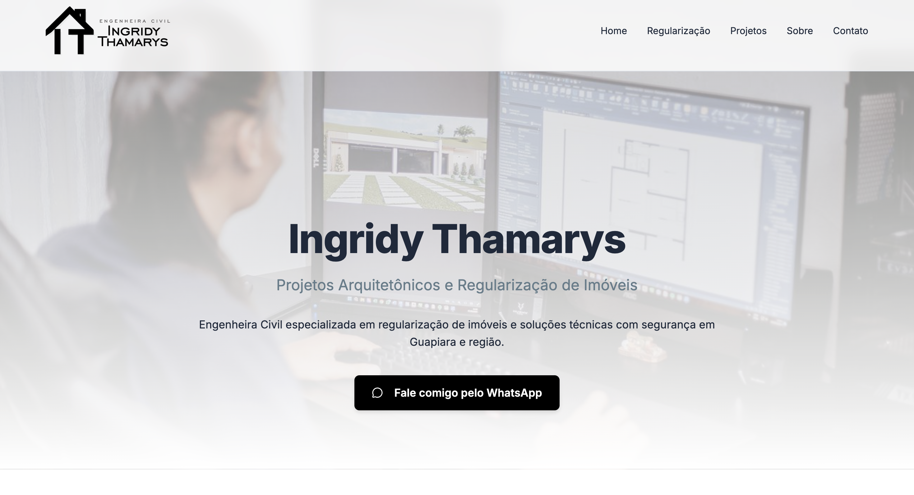

# 🌐 Site Completo – Engenheira Civil

## 📸 Preview do Projeto

Projeto desenvolvido para uma Engenheira Civil, com foco em apresentação profissional, portfólio de projetos e captação de clientes.

O site foi construído com foco em **design moderno, responsividade, performance e conversão**, garantindo uma experiência fluida tanto no desktop quanto no mobile.

---

## 🚀 Objetivo do Projeto

Desenvolver um site institucional completo para:

- Apresentar a profissional e sua área de atuação
- Exibir projetos realizados
- Facilitar o contato com potenciais clientes
- Transmitir credibilidade e autoridade
- Funcionar perfeitamente em todos os dispositivos

---

## 🛠️ Tecnologias Utilizadas

- HTML5
- CSS3
- JavaScript
- Flexbox
- CSS Grid
- Media Queries
- Boas práticas de UI/UX

---

## 📱 Responsividade

O site foi desenvolvido com abordagem **Mobile First**, garantindo:

- Layout adaptável para celulares
- Ajuste automático de imagens e textos
- Menu responsivo
- Elementos reorganizados estrategicamente para telas menores
- Correção de overflow e vazamento de layout

---

## 🎨 Design e Experiência do Usuário

- Paleta de cores alinhada à identidade profissional
- Tipografia moderna e profissional
- Seções organizadas e bem definidas
- Botões de ação (CTA) estratégicos
- Animações suaves para melhor experiência

## ⚡ Performance e Otimização

- Código limpo e organizado
- Estrutura semântica
- Carregamento otimizado
- Fácil manutenção e escalabilidade

---

## 💡 Diferenciais Técnicos

- Layout totalmente customizado
- Organização modular do CSS
- Estrutura preparada para futuras integrações backend
- Código escalável

---

## 👨🏻‍💻 Desenvolvido por

**Gabriel Oliveira**  
Desenvolvedor Web  
Especialista em criar soluções modernas, funcionais e responsivas.

---

⭐ Caso tenha gostado do projeto, considere dar uma estrela no repositório.
